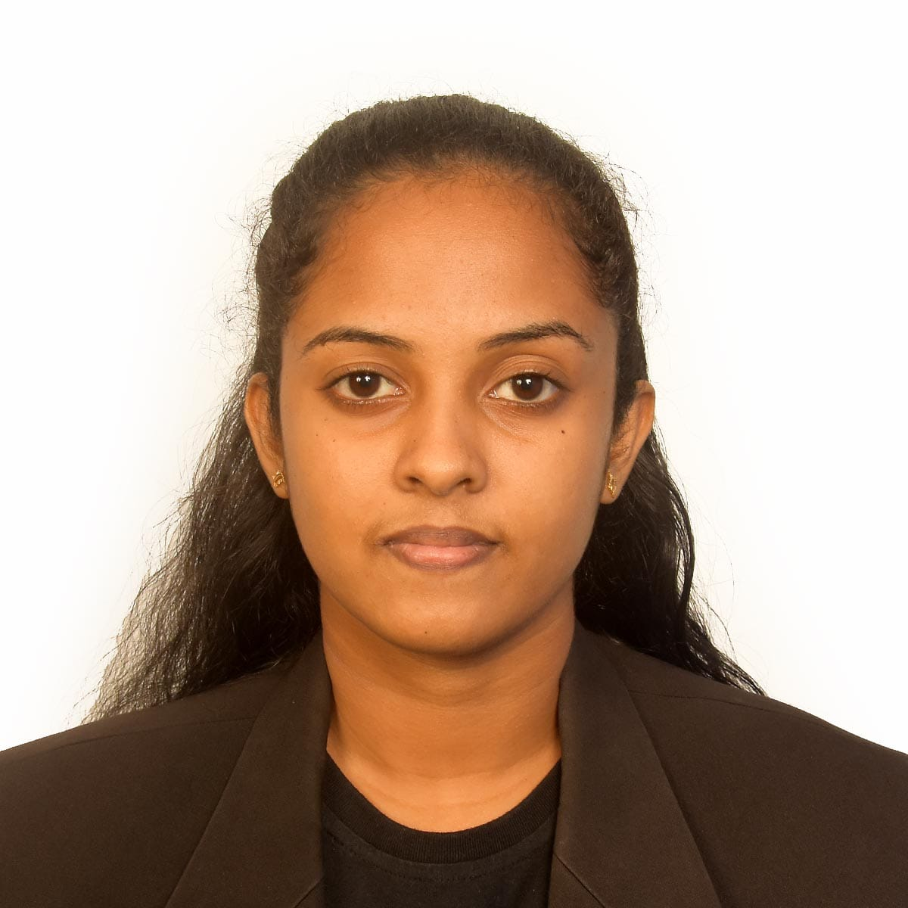

# **RANAPANADA NETHMI MALSHA NIWANTHANI**  

ID NO - 200266002055

Enthusiastic university student seeking employment and working experience. Fluent in English, speaking and writing. Having dedication and passion to get knowledge technically and practically, while giving the best to complete the tasks assigned to achieve the goals and milestones in the working environment.

---

### **📞 Contact Information**  
📱 **Phone:** 0779829064  
📧 **Email:** nethmimalsha30@gmail.com  
🏠 **Address:** 137/1A/4, Bokundara Road, Niwanthidiya, Sri Lanka  

---

## **📚 Education**  

### **G.C.E Ordinary Level (2018)**  
- **Buddhism** - C  
- **Mathematics** - A  
- **Sinhala** - B  
- **ICT** - B  
- **Dancing** - B  
- **English** - C  
- **History** - C  
- **Science** - C  
- **Commerce** - C  

### **G.C.E Advanced Level (2021) – Mathematics Stream**  
- **Physics** - S  
- **Chemistry** - S  
- **Combined Maths** - F  
- **English** - S  

### **Higher Diploma (2024)**  
**Computing and Software Engineering Diploma**  
Completed the Higher Diploma in Computing and Software Engineering (2nd year) at ICBT Campus, offered by Cardiff Metropolitan University in the UK.

---

## **🎓 Qualifications**  
- High National Diploma in Computing and Software Engineering  
- Good communication & interpersonal skills  
- Ability and willingness to work long hours when required  
- Demonstrated ability to provide technical support  

---

## **📌 Other Info**  

### **Objectives**  
- To achieve better development in a dynamic and challenging environment while offering the best of my contribution.  
- To achieve continuous professional development.  
- To become an asset to an employer while earning an adequate compensation in return.  

### **Skills**  
- **LEADERSHIP, TEAMWORK, HARD WORK, MS OFFICE, EMAIL & INTERNET**  

### **Languages**  
- **Sinhala, English**  

## **📜 References**  
**Chamila Attanayake**  
0777446824  
Head of Academics  
Senior Lecturer  
Faculty of IT and Science  
ICBT Campus Nugegoda  
📧 chamila@icbtcampus.edu.lk  
